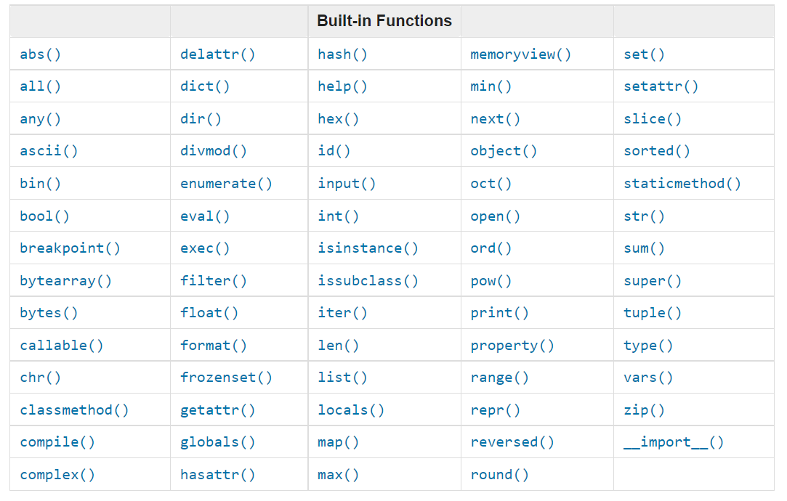

# Python Built-in Functions

## Introduction
Python provides a rich set of built-in functions that are always available for use. These functions perform common tasks and help you write efficient and readable code without needing to import additional modules.

Built-in functions can be used to manipulate data, perform calculations, convert data types, and much more.

## Commonly Used Built-in Functions

- `print()`: Outputs data to the console.
- `len()`: Returns the length of an object such as a string, list, or tuple.
- `type()`: Returns the data type of an object.
- `int()`, `float()`, `str()`: Convert values to integer, float, or string types respectively.
- `input()`: Reads input from the user.
- `sum()`: Returns the sum of all items in an iterable.
- `max()`, `min()`: Return the maximum or minimum value from an iterable.
- `abs()`: Returns the absolute value of a number.
- `round()`: Rounds a floating-point number to a specified number of decimal places.

## Example Usage

```python
print("Hello, World!")  # Prints a string to the console

numbers = [10, 20, 30, 40]
print(len(numbers))  # Outputs: 4

value = 3.14159
print(round(value, 2))  # Outputs: 3.14

text = "Python"
print(type(text))  # Outputs: <class 'str'>

user_input = input("Enter your name: ")
print("Hello, " + user_input)
```

## Visual Guide to Built-in Functions



*Figure: Overview of some commonly used Python built-in functions.*

## Important Built-in Functions Used in Data Science

Python provides several built-in functions that are particularly useful in data science for data manipulation, filtering, and iteration:

- `map(function, iterable)`: Applies a function to all items in an iterable and returns a map object.
- `filter(function, iterable)`: Filters items out of an iterable for which the function returns True.
- `zip(*iterables)`: Aggregates elements from multiple iterables into tuples.
- `enumerate(iterable, start=0)`: Adds a counter to an iterable and returns it as an enumerate object.
- `sorted(iterable, key=None, reverse=False)`: Returns a new sorted list from the items in iterable.
- `any(iterable)`: Returns True if any element of the iterable is true.
- `all(iterable)`: Returns True if all elements of the iterable are true.

### Example Usage

```python
data = [1, 2, 3, 4, 5]

# Using map to square each number
squared = list(map(lambda x: x**2, data))
print(squared)  # [1, 4, 9, 16, 25]

# Using filter to get even numbers
evens = list(filter(lambda x: x % 2 == 0, data))
print(evens)  # [2, 4]

# Using zip to combine lists
names = ['Alice', 'Bob', 'Charlie']
ages = [25, 30, 35]
combined = list(zip(names, ages))
print(combined)  # [('Alice', 25), ('Bob', 30), ('Charlie', 35)]

# Using enumerate to get index and value
for index, value in enumerate(data):
    print(index, value)

# Using sorted to sort data in descending order
sorted_data = sorted(data, reverse=True)
print(sorted_data)  # [5, 4, 3, 2, 1]

# Using any and all
print(any([False, True, False]))  # True
print(all([True, True, True]))    # True
```

## Summary
Built-in functions are essential tools in Python programming. Familiarizing yourself with these functions will help you write concise and effective code.

